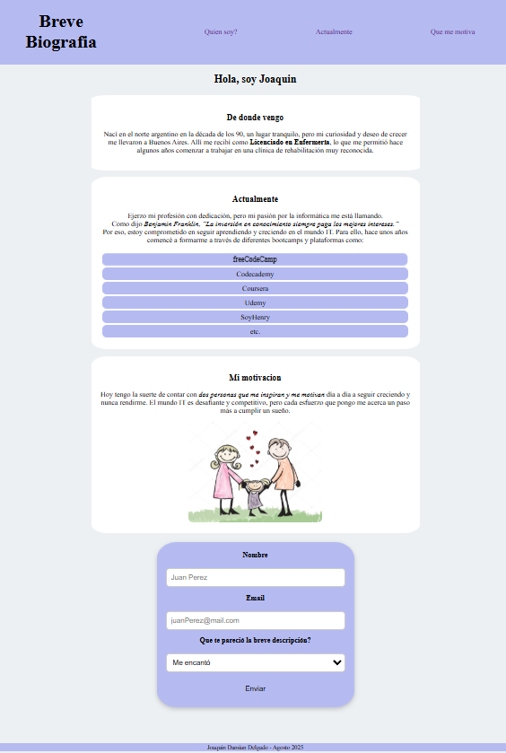

# ANTES DE REACT - MODULO 1 UNIDAD 1

Este proyecto corresponde a la **Unidad 1 del Módulo 1** de la Diplomatura Full Stack.  
Se trata de una pagina hecha completamente en **HTML y CSS**, donde presento una **breve biografía personal**.

La idea fue adaptar las consignas de la **Homework 1** a un proyecto personal

---

## Como ver el proyecto

1. Clonar el repositorio
2. Abrir el archivo Index.html en un navegador web

---

## Autor

Nombre: Joaquín Damián Delgado

Curso: Diplomatura Full Stack

Unidad: Módulo 1 – Unidad 1

Fecha: Agosto 2025

---

## Captura

---

## Bibliografia

-Campus UTN-Learning – Unidad 1 “Antes de React”

-Imagen utilizada en la sección “Motivación”: image.png → extraída de internet
